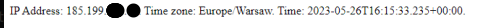

# Docker + NodeJS

Aplikacja wyświetla adres IP odwiedzającego użytkownika i wyświetla czas, jaki obecnie jest po jego stronie.


## 1. Aplikacja
Program jest prostą aplikacją NodeJS+Typescript używającą serwera Express. 

Uruchomić ją można w następujący sposób:

```
npm install
npm start
```

Po uruchomieniu pojawia się w logach port, na którym nasłuchiwane są żądania HTTP, oraz moje imię i nazwisko.

```log
Author: Dawid Pawelec
Server listening on port 8000
```

Gdy użytkownik wejdzie na aplikację, pokaże mu się następująca treść:



Działa to przy pomocy strony `ip-api.com` oferującej bezpłatne API z informacjami o adresach IP.

```ts
// Wywołanie API przy użyciu biblioteki axios
async function callApi(ipAddress: string) {
  const queryUrl = `http://ip-api.com/json/${ipAddress.trim()}`;
  const response = await axios.get(queryUrl);
  return response.data;
}

// Zdobycie IP użytkownika
function getIpAddress(req: Request) {
  const proxyHeader = req.headers['x-forwarded-for'] as string; 
  if (!proxyHeader) {
    return req.socket.remoteAddress; // ip z połączenia
  } else {
    return proxyHeader.split(',')[0].trim(); // jeśli używane jest reverse proxy
  }
}
```

Następnie dzięki wydobytym informacjom znajdujemy czas, jaki jest po stronie użytkownika. Użyta została biblioteka `luxon`.


```ts
const timezoneText = response.timezone as string; // strefa czasowa użytkownika
const timezoneObj = IANAZone.create(timezoneText);
const serverTime = DateTime.now(); // czas po stronie serwera
const userTime = serverTime.setZone(timezoneObj); // przesunięcie czasu serwera do strefy czasowej użytkownika
res.send(`IP Address: ${userIP}. Time zone: ${timezoneObj.name}. Time: ${userTime}.`); // wysłanie odpowiedzi
```

## 2. Dockerfile

W procesie tworzenia obrazu użyto zewnętrznego obrazu `node:18-alpine` zawierający NodeJS w wersji 18.
Spośród różnych wariantów został wybrany `alpine`, ponieważ zawiera on minimalny system operacyjny Alpine Linux.
Pozwala to zmniejszyć wielkość i ilość warstw obrazu, jaki zostanie zbudowany.

Tworzenie obrazu zostało podzielone na dwa etapy.

### Etap build

Z początku przenoszone są jedynie pliki `package.json` i `package-lock.json`. Uruchamiana jest komenda `npm install` pobierająca zależności NPM.

Następnie budowany jest kod źródłowy aplikacji (transpilacja TypeScript -> JavaScript).

```Dockerfile
#syntax=docker/dockerfile:1
# Autor: Dawid Pawelec
FROM node:18-alpine AS build
COPY package*.json ./
RUN npm install
COPY tsconfig.json ./
COPY src ./src
RUN npm run build
```

### Etap uruchomienia

W drugim etapie z pierwszego etapu kopiowany jest folder `node_modules` zawierający zależności projektu oraz folder `dist` zawierający zbudowany kod aplikacji.

Aplikacja może zostać w tym stanie uruchomiona.

```Dockerfile
FROM node:18-alpine
WORKDIR /usr/local/app
COPY --from=build node_modules ./node_modules
COPY --from=build dist ./dist
CMD ["node", "./dist/app.js"]
```

## 3. Dockeryzacja

### Zbudowanie obrazu


Do zbudowania obrazu służy komenda:

```
$ docker build -t dawid11/nodeapp:1.0.0 .
```

```log
[+] Building 7.8s (18/18) FINISHED                                                                                                        
 => [internal] load build definition from Dockerfile                                                                                 0.0s
 => => transferring dockerfile: 361B                                                                                                 0.0s
 => [internal] load .dockerignore                                                                                                    0.0s
 => => transferring context: 59B                                                                                                     0.0s
 => resolve image config for docker.io/docker/dockerfile:1                                                                           1.3s
 => [auth] docker/dockerfile:pull token for registry-1.docker.io                                                                     0.0s
 => CACHED docker-image://docker.io/docker/dockerfile:1@sha256:39b85bbfa7536a5feceb7372a0817649ecb2724562a38360f4d6a7782a409b14      0.0s
 => [internal] load metadata for docker.io/library/node:18-alpine                                                                    0.8s
 => [auth] library/node:pull token for registry-1.docker.io                                                                          0.0s
 => CACHED [stage-1 1/4] FROM docker.io/library/node:18-alpine@sha256:1ccc70acda680aa4ba47f53e7c40b2d4d6892de74817128e0662d32647dd7  0.0s
 => [internal] load build context                                                                                                    0.0s
 => => transferring context: 32.56kB                                                                                                 0.0s
 => [build 2/6] COPY package*.json ./                                                                                                0.0s
 => [build 3/6] RUN npm install                                                                                                      2.9s
 => [build 4/6] COPY tsconfig.json ./                                                                                                0.0s 
 => [build 5/6] COPY src ./src                                                                                                       0.1s 
 => [build 6/6] RUN npm run build                                                                                                    2.1s
 => CACHED [stage-1 2/4] WORKDIR /usr/local/app                                                                                      0.0s 
 => CACHED [stage-1 3/4] COPY --from=build node_modules ./node_modules                                                               0.0s 
 => [stage-1 4/4] COPY --from=build dist ./dist                                                                                      0.0s
 => exporting to image                                                                                                               0.0s
 => => exporting layers                                                                                                              0.0s
 => => writing image sha256:8dedb3a4c7d92213f123104a3e29f69c948c3cd9d56a4111c19cff5e481c7ea0                                         0.0s
 => => naming to docker.io/dawid11/nodeapp:1.0.0                                                                                     0.0s
```

### Uruchomienie zbudowanego obrazu

```
$ docker run -d --name nodeapp -p 8000:8000 dawid11/nodeapp:1.0.0

6250c1f8f0770a2cf4fd308dfe651fd1ed2e4159201f0036f2674f27979da211
```

Aplikacja uruchomi się na porcie 8000.

### Logi aplikacji

```
$ docker logs nodeapp

Author: Dawid Pawelec
Server listening on port 8000
User with IP 5.173.232.141 entered the site.
API Response: {"status":"success","country":"Poland","countryCode":"PL","region":"02","regionName":"Mazovia","city":"Warsaw","zip":"50-019","lat":51.1043,"lon":17.0335,"timezone":"Europe/Warsaw","isp":"P4 Sp. z o.o.","org":"PLAY-Internet","as":"AS201019 P4 Sp. z o.o.","query":"5.173.232.141"}
```

### Weryfikacja warstw

```
$ docker history dawid11/nodeapp:1.0.0

IMAGE          CREATED         CREATED BY                                      SIZE      COMMENT
a2fe0a129986   8 minutes ago   CMD ["node" "./dist/app.js"]                    0B        buildkit.dockerfile.v0
<missing>      8 minutes ago   COPY dist ./dist # buildkit                     4.56kB    buildkit.dockerfile.v0
<missing>      8 minutes ago   COPY node_modules ./node_modules # buildkit     51.1MB    buildkit.dockerfile.v0
<missing>      8 minutes ago   WORKDIR /usr/local/app                          0B        buildkit.dockerfile.v0
<missing>      6 weeks ago     /bin/sh -c #(nop)  CMD ["node"]                 0B        
<missing>      6 weeks ago     /bin/sh -c #(nop)  ENTRYPOINT ["docker-entry…   0B        
<missing>      6 weeks ago     /bin/sh -c #(nop) COPY file:4d192565a7220e13…   388B      
<missing>      6 weeks ago     /bin/sh -c apk add --no-cache --virtual .bui…   7.78MB    
<missing>      6 weeks ago     /bin/sh -c #(nop)  ENV YARN_VERSION=1.22.19     0B        
<missing>      6 weeks ago     /bin/sh -c addgroup -g 1000 node     && addu…   160MB     
<missing>      6 weeks ago     /bin/sh -c #(nop)  ENV NODE_VERSION=18.16.0     0B        
<missing>      8 weeks ago     /bin/sh -c #(nop)  CMD ["/bin/sh"]              0B        
<missing>      8 weeks ago     /bin/sh -c #(nop) ADD file:9a4f77dfaba7fd2aa…   7.05MB    
```