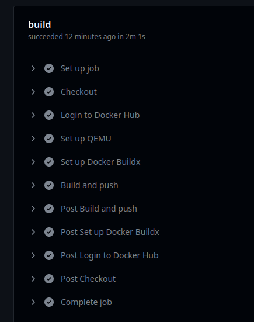
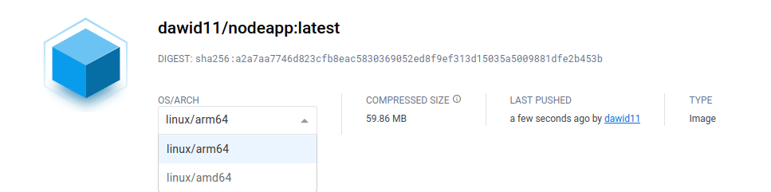

# CI/CD z GitHub Actions

Dla aplikacji `node-docker-app` został przygotowany [plik](./.github/workflows/main.yml) opisujący workflow GitHub Actions. Jego zadaniem jest automatyczne zbudowanie i wdrożenie obrazu na DockerHub przy użyciu QEMU i Docker-Buildx, tak jak zostało to zrobione w [części dodatkowej zadania 1](./zadanie1_dod.md).

Workflow wyzwalany jest przy każdej zmianie na gałęzi `master`:

```yml
on:
  push:
    branches:
      - "master"
```

## Proces budowania obrazu

W pierwszym kroku repozytorium zostaje sklonowane na maszynie wykonującej workflow:

```yml
name: Checkout
uses: actions/checkout@v3
```

Następnie serwer loguje się na wskazane konto Docker Hub. Wykorzystywane są sekrety GitHuba ustawiane na poziomie repozytorium. W ten sposób dane utwierzytelniania nie wyciekną i mogą być łatwo zmieniane.


```yml
name: Login to Docker Hub
uses: docker/login-action@v2
with:
    username: ${{ secrets.DOCKERHUB_USERNAME }}
    password: ${{ secrets.DOCKERHUB_TOKEN }}
 
```

Zanim obraz zostanie zbudowany, należy dodać wsparcie QEMU i skonfigurować instancję docker-buildx:

```yml
-
    name: Set up QEMU
    uses: docker/setup-qemu-action@v2
-
    name: Set up Docker Buildx
    uses: docker/setup-buildx-action@v2
    with:
        platforms: linux/arm64/v8,linux/amd64
```

Ostatecznie obraz zostaje zbudowany i wdrożony na repozytorium DockerHub pod nazwą `nodeapp:latest`:

```yml
name: Build and push
uses: docker/build-push-action@v4
with:
    platforms: linux/arm64/v8,linux/amd64
    context: ./node-docker-app
    push: true
    tags: ${{ secrets.DOCKERHUB_USERNAME }}/nodeapp:latest 

```

## Wynik działania

|  |  |
|----------------------------------------------------------|---------------------------------------------------------------|